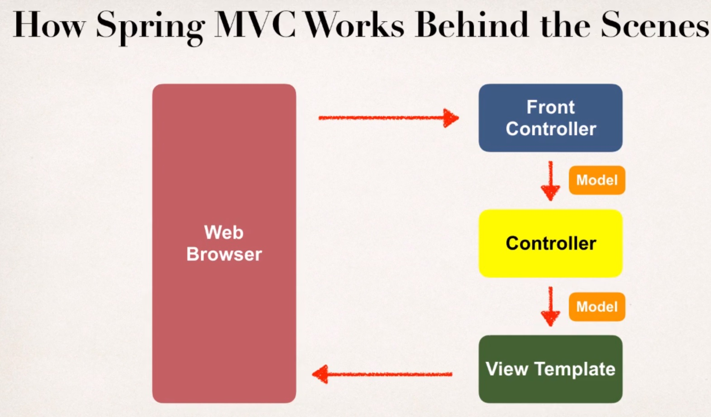

# Section 11. Spring MVC - Building Spring Web Apps

### lecture 95. Spring MVC Overview

스프링 MVC
* MVC 디자인 패턴에 기반한 자바 웹 애플리케이션 개발을 위한 프레임워크
* 스프링의 코어인(IoC, DI) 특징들을 활용한다

스프링 MVC의 장점
* 웹 앱 UI를 스프링 방식으로 만든다
* 재사용 가능한 UI 컴포넌트 집합을 활용한다
* 웹 요청에 대한 애플리케이션 상태 관리를 도와준다
* 폼 데이터 처리를 돕는다 : 밸리데이션, 변환 등
* 뷰 레이어를 위한 유연한 설정을 제공한다

---

### lecture 96. Spring MVC - Behind the Scenes

스프링 MVC 앱의 컴포넌트들
* Web Pages
  - UI 컴포넌트들을 정렬하기 위한 웹 페이지의 집합
* Beans
  - 스프링 빈들(컨트롤러, 서비스 등)의 컬렉션
* Spring Configuration
  - 스프링 설정(XML, 어노테이션, 자바)

### 

Front Controller
* 디스패쳐 서블릿으로 알려져있다
  - 스프링 프레임워크의 일부로 이미 개발되어 있어 사용하기만 하면 된다
  - 요청을 컨트롤러에 위임한다

Model
* 데이터를 가진다
  - 데이터 타입은 모든 자바 객체 혹은 컬렉션이 될 수 있다

View
* 데이터를 보여주는 페이지
* JSP나 JSTL이 많이 사용된다

Controller 
* 비즈니스 로직을 작성
  - 요청 다루기
  - 데이터 저장 / 검색(db, 웹 서비스 등)
  - 모델에 데이터를 위치시킨다
* View 템플릿에 적절하게 데이터를 전송한다

---

### lecture 99. Spring MVC Configuration - Overview
  
스프링 MVC 설정 과정
* WEB-INF/web.xml 파일에 설정을 추가하기
  - 스프링 MVC 디스패쳐 서블릿을 설정
  - 스프링 MVC 디스패쳐 서블릿에 URL 매핑을 설정
* WEB-INF/spring-mvc-demo-servlet.xml 파일에 설정을 추가하기
  - 스프링 컴포넌트 스캐닝 지원을 추가
  - conversion, formatting, validation 지원을 추가
  - 스프링 MVC 뷰 리졸버를 설정

스프링 MVC 디스패쳐 서블릿을 설정
```xml
<!-- web.xml -->
<web-app>

  <servlet>
    <servlet-name>dispatcher</servlet-name>
    <servlet-class>org.springframework.web.servlet.DispatcherServlet</servlet-class>

    <init-param>
      <param-name>contextConfigLocation</param-name>
      <param-value>/WEB-INF/spring-mvc-demo-servlet.xml</param-value>
    </init-param>

    <load-on-startup>1</load-on-startup>
  </servlet>

</web-app>
```

스프링 MVC 디스패쳐 서블릿에 URL 매핑을 설정
```xml
<!-- web.xml -->
<web-app>

  <servlet>
    <servlet-name>dispatcher</servlet-name>
    <servlet-class>org.springframework.web.servlet.DispatcherServlet</servlet-class>
    ...
  </servlet>

  <servlet-mapping>
    <servlet-name>dispatcher</servlet-name>
    <url-pattern>/</url-pattern>
  </servlet-mapping>

</web-app>
```
* 주의할점은 servlet-name이 일치해야 한다는 것이다

스프링 컴포넌트 스캐닝 지원을 추가
```xml
<!-- spring-mvc-demo-servlet.xml -->
<beans>

  <!-- Step 3: Add support for component scanning -->
  <context:component-scan base-package="com.luv2code.springdemo" />

</beans>
```

conversion, formatting, validation 지원을 추가
```xml
<!-- spring-mvc-demo-servlet.xml -->
<beans>

  <!-- Step 3: Add support for component scanning -->
  <context:component-scan base-package="com.luv2code.springdemo" />

  <!-- Step 4: Add support for conversion, formatting and validation support -->
  <mvc:annotation-driven />

</beans>
```
  
스프링 MVC 뷰 리졸버를 설정
```xml
<!-- spring-mvc-demo-servlet.xml -->
<beans>

  <!-- Step 3: Add support for component scanning -->
  <context:component-scan base-package="com.luv2code.springdemo" />

  <!-- Step 4: Add support for conversion, formatting and validation support -->
  <mvc:annotation-driven />

  <!-- Step 5: Define Spring MVC view resolver -->
  <bean
    class="org.springframework.web.servlet.view.InternalResourceViewResolver">
    <property name="prefix" value="/WEB-INF/view/" />
    <property name="suffix" value=".jsp" />
  </bean>

</beans>
```
* show-student-list라는 뷰 이름을 만들면
  - /WEB-INF/view/에서 파일을 찾아서
  - .jsp 확장자를 붙여준다
  - 결과적으로 /WEB-INF/view/show-student-list.jsp가 된다

---

### lecture 102. FAQ: How to configure the Spring Dispatcher Servlet using all Java Code (no xml)

xml 코드 없이 스프링 디스패쳐 서블릿 설정방법
* web.xml과 spring-mvc-demo-servlet.xml 파일을 삭제한다
* 새 자바 패키지를 만든다
* 패키지에 다음과 같은 자바 파일을 추가한다
```java
// DemoAppConfig.java
import org.springframework.context.annotation.Bean;
import org.springframework.context.annotation.ComponentScan;
import org.springframework.context.annotation.Configuration;
import org.springframework.web.servlet.ViewResolver;
import org.springframework.web.servlet.config.annotation.EnableWebMvc;
import org.springframework.web.servlet.view.InternalResourceViewResolver;
 
@Configuration
@EnableWebMvc
@ComponentScan(basePackages="com.luv2code.springdemo")
public class DemoAppConfig {
 
	// define a bean for ViewResolver
 
	@Bean
	public ViewResolver viewResolver() {
		
		InternalResourceViewResolver viewResolver = new InternalResourceViewResolver();
		
		viewResolver.setPrefix("/WEB-INF/view/");
		viewResolver.setSuffix(".jsp");
		
		return viewResolver;
	}
	
}

// MySpringMvcDispatcherServletInitializer.java
import org.springframework.web.servlet.support.AbstractAnnotationConfigDispatcherServletInitializer;
 
public class MySpringMvcDispatcherServletInitializer extends AbstractAnnotationConfigDispatcherServletInitializer {
 
	@Override
	protected Class<?>[] getRootConfigClasses() {
		// TODO Auto-generated method stub
		return null;
	}
 
	@Override
	protected Class<?>[] getServletConfigClasses() {
		return new Class[] { DemoAppConfig.class };
	}
 
	@Override
	protected String[] getServletMappings() {
		return new String[] { "/" };
	}
 
}
```
* Video 403 - Spring MVC All Java Config에 위 코드의 작동 원리가 나와있다