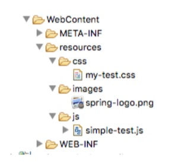

# Section 12. Spring MVC - Creating Controllers and Views

### lecture 103. Creating a Spring Home Controller and View - Overview

개발 과정
* 컨트롤러 클래스 만들기
* 컨트롤러 메서드 정의하기
* 요청과 컨트롤러 메서드를 매핑하기
* 뷰네임을 반환하기
* 뷰페이지 개발하기

컨트롤러 클래스 만들기
```java
@Controller
public class HomeController {}
```
* @Controller 어노테이션을 사용하면 된다
  - @Controller는 @Component를 상속받았다
  - 스캐닝을 지원한다

컨트롤러 메서드 정의하기
```java
@Controller
public class HomeController {

  public String showMyPage() {
    //...
  }

}
```
* 메서드 이름은 자유롭게 설정할 수 있다

요청과 컨트롤러 메서드를 매핑하기
```java
@Controller
public class HomeController {

  @RequestMapping("/")
  public String showMyPage() {
    //...
  }

}
```
* @RequestMapping 어노테이션을 사용한다
  - 인자로 경로를 작성한다

뷰네임을 반환하기
```java
@Controller
public class HomeController {

  @RequestMapping("/")
  public String showMyPage() {
    return "main-menu";
  }

}
```
* main-menu라는 뷰네임을 반환한다
  - 스프링은 백그라운드에서 /WEB-INF/view/main-menu.jsp로 변경한다

뷰페이지 개발하기
```jsp
<html>
<body>
  <h2>Spring MVC demo - Home Page</h2>
</body>
</html>
```

---

### lecture 109. Reading HTML Form Data - Overview

HTML 폼 데이터 읽어오기
* input 창에 문자를 입력하고 전송버튼을 누르면 이름을 변경해주는 로직 작성

컨트롤러 클래스 작성
```java
import org.springframework.stereotype.Controller;
import org.springframework.web.bind.annotation.RequestMapping;

@Controller
public class HelloWorldController {

	@RequestMapping("/showForm")
	public String showForm() {
		return "helloworld-form";
	}
	
	@RequestMapping("/processForm")
	public String processForm() {
		return "helloworld";
	}
}

```
* 폼을 보여주는 showForm 메서드 작성
* 입력값을 처리하는 processForm 메서드 작성

jsp파일 작성
```html
<!-- helloworld-form.jsp -->
<!DOCTYPE html>
<html>
<head>
  <title>Hello world - Input Form</title>
</head>
<body>
  <form action="processForm" method="GET">
  
    <input type="text" name="studentName"
      placeholder="What's your name?" />
    <input type="submit" />
  </form>
</body>
</html>

<!-- helloworld.jsp -->
<!DOCTYPE html>
<html>
<head>
</head>
<body>

Hello World of Spring!

<br />

Student name: ${param.studentName}

</body>
</html>
```
* input의 name 프로퍼티를 지정해서 param.프로퍼티값으로 활용할 수 있다

---

### lecture 113. Adding Data to the Spring Model - Overview

스프링 모델
* 데이터 컨테이너를 담당
* 컨트롤러에서 모델에 특정 값을 집어넣을 수 있다
  - 문자열, 객체, 데이터베이스 정보 등
* 뷰페이지(JSP)에서 모델을 통해 데이터에 접근할 수 있다

예제
* 앞서 만들었던 폼데이터 읽어오기를 발전시킬 것이다
* 학생 이름을 폼에서 입력 받아온다
* 이름을 대문자로 변환한다
* 변환한 이름을 모델에 추가한다

컨트롤러에 모델 넘겨주기
```java
// ...
@RequestMapping("/processFormVersionTwo")
public String letsShoutDude(HttpServletRequest request, Model model) {
		
		String theName = request.getParameter("studentName");
		
		theName = theName.toUpperCase();
		
		String result = "Yo! " + theName;
		
		model.addAttribute("message", result);
		
		return "helloworld";
}
// ...
```
* 폼에서 데이터를 받아와서 모델에 addAttributes를 호출해 key, value 형식으로 인자를 넘겨서 사용한다

```html
<!-- helloworld.jsp -->
<!DOCTYPE html>
<html>
<head>
</head>
<body>

Hello World of Spring!

<br />

The message: ${message}

</body>
</html>
```

다음 코드처럼 모델에 더 많은 데이터를 추가할 수 있다
```java
String result = ...;
List<Student> theStudentList = ...;
ShoppingCart theShoppingCart = ...;

model.addAttribute("message", result);

model.addAttribute("students", theStudentList);

model.addAttribute("shoppingCart", theShoppingCart);
```

---

### lecture 116. FAQ: How to use CSS, JavaScript and Images in Spring MVC Web App

스프링 MVC 웹 앱에서 정적 파일들을 사용하는 방법
* 정적 파일에 대한 참조를 spring-mvc-demo-servlet.xml에 추가
```xml
<!-- spring-mvc-demo-servlet.xml -->
<mvc:resources mapping="/resources/**" location="/resources/"></mvc:resources> 
```

* JSP에서 위에서 등록한 참조를 다음과 같이 사용할 수 있다
```html
<!DOCTYPE html> <html>

<head>

    <link rel="stylesheet" type="text/css"           

           href="${pageContext.request.contextPath}/resources/css/my-test.css">

    <script src="${pageContext.request.contextPath}/resources/js/simple-test.js"></script>

</head>

<body>

<h2>Spring MVC Demo - Home Page</h2>

<a href="hello">Plain Hello World</a>

<br><br>


<br><br>

<input type="button" onclick="doSomeWork()" value="Click Me"/>

</body>

</html>
```
* ${pageContext.request.contextPath}로 웹 앱의 루트 디렉토리에 접근한다
* css, image, js 파일 모두 이 방식으로 사용할 수 있다

* 폴더 구조 예시
  ### 

---

### lecture 117. Bonus: Deploying To Tomcat using WAR files

자바 웹앱을 WAR 파일을 사용해서 배포하기
* WAR 파일은 웹 앱을 압축한 파일이다
* zip 파일 포맷처럼 사용하지만 .war 확장자를 가진다
* 만약 이클립스를 사용한다면 WebContent 폴더를 .war 확장자로 압축하는 것이 가장 좋은 방법이다
  - 이 폴더는 jsp, css, js, image 등 모든 정적 파일을 포함하고 있다
  - JAR 파일도 가지고 있다
* WAR 파일 포맷은 Java EE / Servlet 스펙의 일부다

이클립스에서 WAR 파일 만드는 과정
1. 톰캣을 중지시키기
2. 프로젝트를 우클릭하고 Export > WAR File을 선택
3. Destination 칸에 [디렉토리명]/[앱이름].war 형식으로 입력한다
4. 이클립스 외부에서 톰캣을 시작한다(윈도우 사용자라면 시작 메뉴에서 찾아라)
5. http://localhost:8080에 접속한다
6. [톰캣을 설치한 디렉토리]\webapps에 WAR 파일을 복사해서 배포한다
7. 배포에 10-15초 정도 걸린다 webapps에 새 폴더가 WAR파일 이름으로 생성되면서 배포가 완료된 것을 확인할 수 있다
8. 배포된 새 앱에 방문해보기. 만약 만들었던 파일이 mycoolapp.war라면 http://localhost:8080/mycoolapp/로 방문하면 된다

---