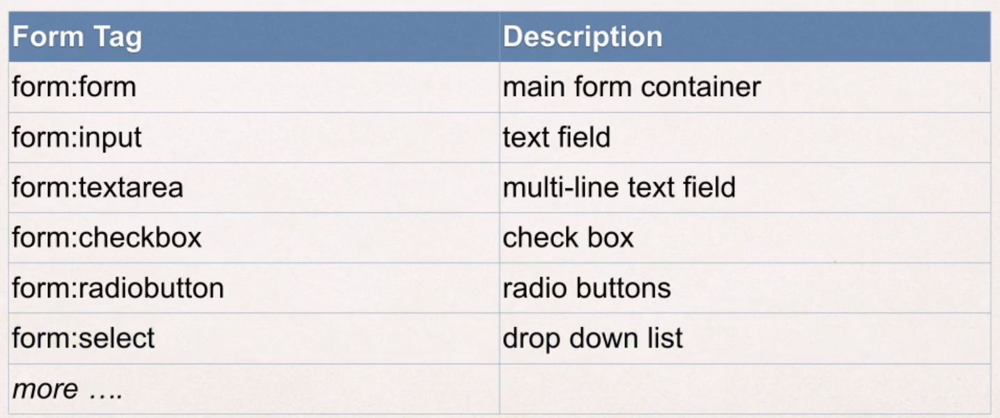

# Section 14. Spring MVC - Form Tags and Data Binding

### lecture 124. Spring MVC Form Tags Overview

스프링에서 폼을 어떻게 다루는지 알아보기
* 스프링은 웹에서 사용할 수 있는 폼을 지원한다
* 폼 태그들은 설정과 재사용이 가능하다
* Spring MVC 폼 태그들은 데이터 바인딩을 사용할 수 있다
  - 자동 세팅, 자바 객체 혹은 빈에서 데이터 검색이 가능하다

자주 사용하는 폼 태그 목록
### 
* <a href="www.luv2code.com/spring-mvc-form-tags">더 많은 폼 태그 알아보기</a>

스프링 폼 태그 사용법 예시
```jsp
<%@ taglib prefix="form" uri="http://www.springframework.org/tags/form" %>
```
* JSP 페이지에 위와 같은 방식으로 사용할 수 있다

### lecture 125. Text Fields - Overview

폼 보여주기 - 모델 속성 추가하기
```java
@RequestMapping("/showForm")
public String showForm(Model theModel) {

  theModel.addAttribute("student", new Student());

  return "student-form";
}
```
* 모델은 컨트롤러와 뷰 사이에 데이터를 전달하기 위해 사용되고 있다
* addAttribute의 첫번째 인자인 모델의 이름은 추후 JSP 파일의 폼 태그에서 modelAttribute에 사용될 것이다

jsp 폼 설정 - 데이터 바인딩
```jsp
<form:form action="processForm" modelAttribute="student">

  First name: <form:input path="firstName" />

  <br />

  Last name: <form:input path="lastName" />

  <br />

  <input type="submit" value="Submit" />

</form:form>
```
* 앞서 봤던 스프링 MVC 폼 태그를 사용하고 있다
  - form:form, form:input
* 앞서 모델의 addAttribute 메서드로 설정한 이름을 modelAttribute의 값으로 지정해 바인딩한다
* First name과 Last name의 path는 빈에서 바인딩된다
* 폼이 로딩되고 나면, 스프링 MVC는 path가 firstName인 폼을 다음과 같은 메서드로 호출한다
  - student.getFirstName()
* 위와 같이 path가 lastName인 폼은 student.getLastName()이 호출된다
* 폼이 제출되면(submit) 스프링 MVC는 세터 메서드를 호출한다
  - student.setFirstName(...), student.setLastName(...)

컨트롤러에서 제출된 폼 다루기
```java
@RequestMapping("/processForm")
public String processForm(@ModelAttribute("student") Student theModel) {

  // log the input data
  System.out.println("theStudent: " + theStudent.getLastName());

  return "student-confirmation";
}
```
* @ModelAttribute 어노테이션으로 폼 데이터를 객체에 바인딩할 수 있다
  - 객체는 폼 데이터로 채워진다

---

### lecture 126. Text Fields - Write Some Code - Part 1

개발 과정
1. Student 클래스 생성
2. Student 컨트롤러 클래스 생성
3. jsp 폼 생성
4. 폼 처리 코드 작성
5. 확인 페이지 작성

Student 클래스 생성
```java
public class Student {

	private String firstName;
	private String lastName;
	
	public Student() {
		
	}
	
	public String getFirstName() {
		return firstName;
	}
	public void setFirstName(String firstName) {
		this.firstName = firstName;
	}
	public String getLastName() {
		return lastName;
	}
	public void setLastName(String lastName) {
		this.lastName = lastName;
	}
	
}
```

Student 컨트롤러 클래스 생성
```java
import org.springframework.stereotype.Controller;
import org.springframework.ui.Model;
import org.springframework.web.bind.annotation.RequestMapping;

@Controller
@RequestMapping("/student")
public class StudentController {
  
	@RequestMapping("/showForm")
	public String showForm(Model theModel) {
		
		Student theStudent = new Student();
		
		theModel.addAttribute("student", theStudent);
		
		return "student-form";
	}
	
}
```

---

### lecture 127. Text Fields - Write Some Code - Part 2

jsp 폼 생성
```jsp
<!-- student-form.jsp -->
<%@ taglib prefix="form" uri="http://www.springframework.org/tags/form" %>
<!DOCTYPE jsp>

<jsp>

<head>
  <title>Student Registration Form</title>
</head>

<body>

  <form:form action="processForm" modelAttribute="student">

    First name: <form:input path="firstName"/>
    
    <br />
  
    Last name: <form:input path="lastName"/>
    
    <br />
    
    <input type="submit" value="Submit" />
    
  </form:form>

</body>

</jsp>
```

폼 처리 코드 작성
```java
import org.springframework.stereotype.Controller;
import org.springframework.ui.Model;
import org.springframework.web.bind.annotation.ModelAttribute;
import org.springframework.web.bind.annotation.RequestMapping;

@Controller
@RequestMapping("/student")
public class StudentController {
  
	@RequestMapping("/showForm")
	public String showForm(Model theModel) {
		
		Student theStudent = new Student();
		
		theModel.addAttribute("student", theStudent);
		
		return "student-form";
	}
	
	@RequestMapping("/processForm")
	public String processForm(@ModelAttribute("student") Student theStudent) {
		
		System.out.println("theStudent: " + theStudent.getLastName() + " " + theStudent.getFirstName());
		
		return "student-confirmation";
	}
}
```

확인 페이지 작성
```jsp
<!DOCTYPE jsp>
<jsp>
<head>
<title>Student Confirmation</title>
</head>
<body>

The student is confirmed: ${student.firstName} ${student.lastName}

</body>
</jsp>
```
* ${student.firstName}은 student.getFirstName을 호출한다
* ${student.lastName}은 student.getLastName을 호출한다

---

### lecture 129. Drop-Down Lists - Overview

스프링 MVC 폼 태그로 드롭다운 리스트 만들기
* form:select 태그를 사용한다

```jsp
<form:select path="country">

  <form:option value="Brazil" label="Brazil" />
  <form:option value="France" label="France" />
  <form:option value="Germany" label="Germany" />
  <form:option value="India" label="India" />

</form:select>
```
* path로 데이터를 바인딩하고 있다
* value는 폼이 제출됐을때 코드에서 사용할 값이다
* label은 보여주기 위한 값이다

---

### lecture 130. Drop-Down Lists - Write Some Code - Part 1

개발 과정
1. HTML 폼을 갱신
2. Student 클래스 갱신 - 새로운 속성에 게터 / 세터 메서드 추가하기
3. 확인 페이지 갱신

HTML 폼을 갱신
```jsp
<!-- student-form.jsp -->
<%@ taglib prefix="form" uri="http://www.springframework.org/tags/form" %>
<!DOCTYPE html>

<html>

<head>
  <title>Student Registration Form</title>
</head>

<body>

  <form:form action="processForm" modelAttribute="student">

    First name: <form:input path="firstName"/>
    
    <br />
  
    Last name: <form:input path="lastName"/>
    
    <br />
    
    Country:
    
    <form:select path="country">
    
       <form:option value="Brazil" label="Brazil" />
       <form:option value="France" label="France" />
       <form:option value="Germany" label="Germany" />
       <form:option value="India" label="India" />
    
    </form:select>
    
    <br />
    
    <input type="submit" value="Submit" />
    
  </form:form>

</body>

</html>
```
* 이제 폼이 제출되면 student.setCountry가 추가로 호출될 것이다

Student 클래스 갱신 - 새로운 속성에 게터 / 세터 메서드 추가하기
```java
public class Student {

	private String firstName;
	private String lastName;
	private String country;
	
	public Student() {
		
	}
	
	public String getFirstName() {
		return firstName;
	}
	public void setFirstName(String firstName) {
		this.firstName = firstName;
	}
	public String getLastName() {
		return lastName;
	}
	public void setLastName(String lastName) {
		this.lastName = lastName;
	}
	public String getCountry() {
		return country;
	}
	public void setCountry(String country) {
		this.country = country;
	}
	
}
```

확인 페이지 갱신
```jsp
<!DOCTYPE html>
<html>
<head>
<title>Student Confirmation</title>
</head>
<body>

The student is confirmed: ${student.firstName} ${student.lastName}

<br />

Country: ${student.country}

</body>
</html>
```

---

### lecture 131. Drop-Down Lists - Write Some Code - Part 2

JSP에 옵션 목록을 하드코딩하지 말고 자바 클래스로 처리하기
```java
public class Student {

	private String firstName;
	private String lastName;
	private String country;
	
	private LinkedHashMap<String, String> countryOptions;
	
	public Student() {
		
		// populate country options: used ISO country code
		countryOptions = new LinkedHashMap<>();
		
		countryOptions.put("BR", "Brazil");
		countryOptions.put("FR", "France");
		countryOptions.put("GE", "Germany");
		countryOptions.put("IN", "India");
    countryOptions.put("US", "United States of America");
	}
	
	public String getFirstName() {
		return firstName;
	}
	public void setFirstName(String firstName) {
		this.firstName = firstName;
	}
	public String getLastName() {
		return lastName;
	}
	public void setLastName(String lastName) {
		this.lastName = lastName;
	}
	public String getCountry() {
		return country;
	}
	public void setCountry(String country) {
		this.country = country;
	}
	public LinkedHashMap<String, String> getCountryOptions() {
		return countryOptions;
	}
	
}
```
* 해쉬맵을 만들어 country 목록을 만든다
* 해쉬맵의 게터 메서드를 만들어 폼을 로드했을때 해쉬맵의 목록들이 자동으로 채워지게 만든다

하드코딩된 JSP 페이지 갱신
```jsp
<%@ taglib prefix="form" uri="http://www.springframework.org/tags/form" %>
<!DOCTYPE html>

<html>

<head>
  <title>Student Registration Form</title>
</head>

<body>

  <form:form action="processForm" modelAttribute="student">

    First name: <form:input path="firstName"/>
    
    <br />
  
    Last name: <form:input path="lastName"/>
    
    <br />
    
    Country:
    
    <form:select path="country">
    
       <form:options items="${student.countryOptions}"/>
    
    </form:select>
    
    <br />
    
    <input type="submit" value="Submit" />
    
  </form:form>

</body>

</html>
```
* form:options 태그를 사용하고 items 속성에 해쉬맵 객체를 지정해서 매핑한다

---

### lecture 132. FAQ: Use properties file to load country options

#### country목록을 파일에서 불러오는 방법
  
1. key = value 형식으로 파일을 작성한다
```file
BR=Brazil
FR=France
CO=Colombia
IN=India
```
* WEB-INF/countries.properties에 작성한다

2. 스프링 설정 파일에 헤더를 갱신
```xml
<?xml version="1.0" encoding="UTF-8"?>
<beans xmlns="http://www.springframework.org/schema/beans" 
        xmlns:context="http://www.springframework.org/schema/context" 
        xmlns:mvc="http://www.springframework.org/schema/mvc" 
        xmlns:util="http://www.springframework.org/schema/util" 
        xmlns:xsi="http://www.w3.org/2001/XMLSchema-instance" 
        xsi:schemaLocation="
            http://www.springframework.org/schema/beans     
            http://www.springframework.org/schema/beans/spring-beans.xsd     
            http://www.springframework.org/schema/context     
            http://www.springframework.org/schema/context/spring-context.xsd     
            http://www.springframework.org/schema/mvc         
            http://www.springframework.org/schema/mvc/spring-mvc.xsd 
            http://www.springframework.org/schema/util     
            http://www.springframework.org/schema/util/spring-util.xsd">
```
* util 태그 사용을 위해 헤더를 변경해야 한다
* 이전에 있었던 헤더를 삭제하고 위 헤더를 spring-mvc-dmo-servlet.xml 파일에 추가한다

3. 파일에 작성한 country 옵션 목록을 불러오기
```xml
<util:properties id="countryOptions" 
location="classpath:../countries.properties" />
```
* countryOptions을 id로 가지는 빈을 불러온다
* spring-mvc-dmo-servlet.xml에 위 코드를 추가한다

4. StudentController.java에 country 목록을 주입하기
```java
@Value("#{countryOptions}") 
private Map<String, String> countryOptions;
```

5. 스프링 MVC 모델에 theCountryOptions라는 속성 네임으로 country 목록을 추가하기
```java
@RequestMapping("/showForm") 
public String showForm(Model theModel) { 
 
    // create a student object Student 
    Student theStudent = new Student();
 
    // add student object to the model 
    theModel.addAttribute("student", theStudent); 
 
    // add the country options to the model 
    theModel.addAttribute("theCountryOptions", countryOptions); 
 
    return "student-form"; 
}
```

6. theCountryOptions를 사용하게끔 student-form.jsp 갱신하기
```jsp
<form:select path="country"> 
 <form:options items="${theCountryOptions}" />
</form:select>
```

7. Student.java의 country목록에 대한 모든 참조를 제거한다

---

### lecture 133. Radio Buttons - Overview

form:radiobutton
* 라디오 버튼을 사용하기 위해 jsp에서는 이 태그를 사용한다
```jsp
Java <form:radiobutton path="favoriteLanguage" value="Java" />
C# <form:radiobutton path="favoriteLanguage" value="C#" />
PHP <form:radiobutton path="favoriteLanguage" value="PHP" />
Ruby <form:radiobutton path="favoriteLanguage" value="Ruby" />
```
* 데이터 바인딩을 위해 path 프로퍼티에 값을 지정한다
  - 폼이 제출되면(submit) 스프링은 student.setFavoriteLanguage를 호출한다

---

### lecture 135. FAQ: How to populate radiobuttons with items from Java class?

드롭다운 리스트에서 처럼 jsp에 하드코딩하지 않고 자바 목록에서 라디오 버튼 불러오는 방법
* 드롭다운과 유사하게 접근하면 된다

먼저 Student 클래스에 데이터를 준비한다
```java
private LinkedHashMap<String, String> favoriteLanguageOptions;

// 생성자에서 목록을 채운다

// populate favorite language options
favoriteLanguageOptions = new LinkedHashMap<>
// parameter order: value, display label

favoriteLanguageOptions.put("Java", "Java");
favoriteLanguageOptions.put("C#", "C#");
favoriteLanguageOptions.put("PHP", "PHP");
favoriteLanguageOptions.put("Ruby", "Ruby");     

// 게터 메서드를 만든다
public LinkedHashMap<String, String> getFavoriteLanguageOptions() {
    return favoriteLanguageOptions;
}
```

폼에서 데이터 참조하기
```jsp
<form:radiobuttons path="favoriteLanguage" 
items="${student.favoriteLanguageOptions}" />
```

---

### lecture 136. Checkboxes - Overview

체크 박스 사용하기
* jsp에서는 form:checkbox 태그를 사용할 수 있다

코드 예제
```jsp
Linux <form:checkbox value="operatingSystems" value="Linux" />
Mac OS <form:checkbox value="operatingSystems" value="Mac OS" />
MS Windows <form:checkbox value="operatingSystems" value="MS Windows" />
```
* 데이터 바인딩을 위해 path를 사용한다
* 라디오 버튼과 달리 유저로부터 여러개가 체크된 결과를 받을 수 있다
* 그러므로 문자열 배열과 적절한 게터 / 세터 메서드를 사용해야 한다

```java
// Student.java

// 필드 추가
private String[] operatingSystems;

// 게터 세터 추가
public String[] getOperatingSystems() {
	  return operatingSystems;
}
public void setOperatingSystems(String[] operatingSystems) {
	  this.operatingSystems = operatingSystems;
}
```

```jsp
<!-- student-confirmation.jsp -->
<%@ taglib uri="http://java.sun.com/jsp/jstl/core" prefix="c" %>

<!-- ... -->

Operating Systems: 

<ul>
  <c:forEach var="temp" items="${student.operatingSystems}" >
    <li> ${temp} </li>
  </c:forEach>
</ul>
```

---