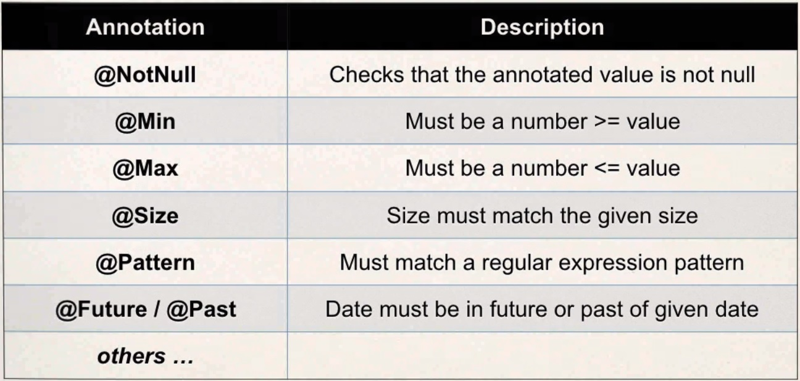

# Section 15. Spring MVC Form Validation - Applying Built-In Validation Rules

### lecture 139. Spring MVC Form Validation - Overview

유저가 보낸 입력값 검증하기
* 필수 필드
* 유효값(ex. 범위 안의 숫자인가)
* 유효 형식(ex. 우편번호)
* 자체적인 비즈니스 규칙 등

자바 공식 빈 검증 API
* 자바는 공식 빈 검증 API를 가지고 있다
  - 엔터티 검증을 위한 메타데이터 모델과 API를 정의한다
  - 웹과 퍼시스턴스 계층 어느 한쪽에 엮이지 않는다
  - 서버와 클라이언트(ex. JavaFX, Swing) 모두 사용가능하다
* <a href="http://www.beanvalidation.org" >공식 홈페이지 링크</a>

스프링과 검증
* 스프링 4버전 이상에서는 빈 검증 API를 지원한다
* 그러므로 스프링 앱을 만들때 검증을 위한 API를 사용할 수 있다
* 간단하게 검증 JAR를 프로젝트에 추가할 수 있다
  - 하이버네이트 홈페이지에서 받을 수 있다
  - <a href="http://www.hibernate.org">하이버네이트 홈페이지</a>

검증을 위한 어노테이션 목록
### 

---

### lecture 142. Checking for Required Fields Overview

앞서 만들었던 프로젝트에서 Last name을 필수 필드로 만들 것이다
* Last name이 채워지지 않았다면 폼의 제출을 거부하고 해당 필드 옆에 빨간 글씨로 is required를 출력한다

개발과정
1. Customer 클래스에 검증 룰을 추가
2. HTML form에 에러 메시지 보여주기
3. 컨트롤러 클래스에서 검증하기
4. 확인 페이지 갱신

Customer 클래스에 검증 룰을 추가
```java
import javax.validation.constraints.NotNull;
import javax.validation.constraints.Size;

public class Customer {

	private String firstName;
	
	@NotNull(message="is required")
	@Size(min=1, message="is required")
	private String lastName;

	public String getFirstName() {
		return firstName;
	}

	public void setFirstName(String firstName) {
		this.firstName = firstName;
	}

	public String getLastName() {
		return lastName;
	}

	public void setLastName(String lastName) {
		this.lastName = lastName;
	}
		
}
```
* 제출된 lastName 폼이 null이거나 길이가 1보다 작으면 is required 메시지를 출력한다

HTML form에 에러 메시지 보여주기
```jsp
<form:form action="processForm" modelAttribute="customer">

  First name: <form:input path="firstname" />
  
  <br />
  
  Last name (*): <form:input path="lastname" />
  <form:errors path="lastname" cssClass="error" />

  <br />
  
  <input type="submit" value="Submit" />
  
</form:form>
```

컨트롤러 클래스에서 검증하기
```java
import javax.validation.Valid;

import org.springframework.stereotype.Controller;
import org.springframework.ui.Model;
import org.springframework.validation.BindingResult;
import org.springframework.web.bind.annotation.ModelAttribute;
import org.springframework.web.bind.annotation.RequestMapping;

@Controller
@RequestMapping("/customer")
public class CustomerController {
	
	@RequestMapping("/showForm")
	public String showForm(Model theModel) {
		
		theModel.addAttribute("customer", new Customer());
		
		return "customer-form";
	}

	@RequestMapping("/processForm")
	public String processForm(@Valid @ModelAttribute("customer") Customer theCustomer,
			                  BindingResult theBidingResult) {
		if (theBidingResult.hasErrors()) {
			return "customer-form";
		} else {
			return "customer-confirmation";
		}
	}
}

```
* @Valid 어노테이션은 Customer 객체에 검증을 실행하게 해준다
* 검증된 결과는 BindingResult 객체에 저장된다
  - 스프링이 뒤에서 처리해준다

확인 페이지 갱신
```jsp
<!-- customer-confirmation.jsp -->
<!DOCTYPE html>
<html>
<head>
<meta charset="EUC-KR">
<title>Insert title here</title>
</head>
<body>

The customer is confirmed: ${customer.firstName} ${customer.lastName}

</body>
</html>
```

---

### lecture 143. Special Note about BindingResult Parameter Order

BindingResult 파라미터의 순서
* 반드시 model attribute 바로 뒤에 위치해야 한다
  - 다른 곳에 위치시키면 스프링 MVC 검증은 원하는대로 작동하지 않는다

스프링 레퍼런스 매뉴얼에 나와있는 문장
```text
@RequestMapping methods

@RequestMapping handler methods have a flexible signature and can choose from a range of supported controller method arguments and return values.

(...)

The Errors or BindingResult parameters have to follow the model object that is being
bound immediately (...)
```
* <a href="https://docs.spring.io/spring/docs/current/spring-framework-reference/web.html#mvc-ann-methods">공식 문서 링크</a>

---

### lecture 150. Add Pre-processing Code with @InitBinder - Overview

White Space
* 앞서 만들었던 lastName 폼의 검증 로직은 white space를 입력하면 통과한다
* 이를 처리하기 위해서 @InitBinder 어노테이션을 사용할 수 있다
  - 전처리기 역할을 담당한다
  - 컨트롤러에서 각 요청마다 전처리를 한다
  - 여러 기능중 trim 기능도 가지고 있다
  - 만약 문자열이 white space들로만 되어 있으면, null값으로 변환시킨다

예제 코드
```java
@InitBinder
public void initBinder(WebDataBinder dataBinder) {
	  StringTrimmerEditor stringTrimmerEditor = new StringTrimmerEditor(true);
	  
	  dataBinder.registerCustomEditor(String.class, stringTrimmerEditor);
}
```

---