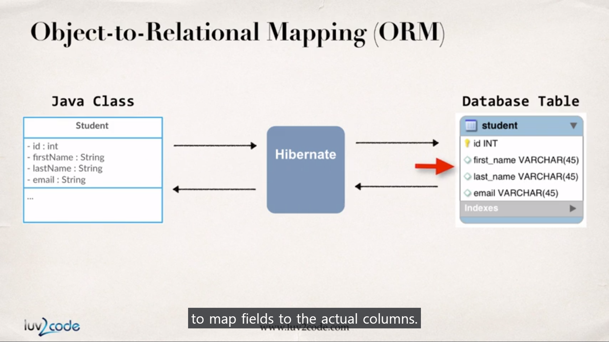

# Section 20. Hibernate Configuration with Annotations

### lecture 178. Hibernate Development Process Overview

할일 목록
1. 하이버네이트 구성 파일 추가
2. 자바 클래스 애노테이트Annotate
3. 데이터베이스 동작을 위한 자바 코드 개발

---

### lecture 179. Creating the Hibernate Configuration File

설정 파일
* 하이버네이트가 어떻게 데이터베이스에 연결할지 알려준다
  - 하이버네이트는 백그라운드에서 JDBC를 이용하므로 결국 설정 파일의 많은 내용은 JDBC에 관련된 것이다(id, pw..)
* src폴더에 다음과 같은 코드를 작성해준다
```xml
<!-- hibernate.cfg.xml -->
<!DOCTYPE hibernate-configuration PUBLIC
        "-//Hibernate/Hibernate Configuration DTD 3.0//EN"
        "http://www.hibernate.org/dtd/hibernate-configuration-3.0.dtd">

<hibernate-configuration>

    <session-factory>

        <!-- JDBC Database connection settings -->
        <property name="connection.driver_class">com.mysql.cj.jdbc.Driver</property>
        <property name="connection.url">jdbc:mysql://localhost:3306/hb_student_tracker?useSSL=false&amp;serverTimezone=UTC</property>
        <property name="connection.username">hbstudent</property>
        <property name="connection.password">hbstudent</property>

        <!-- JDBC connection pool settings ... using built-in test pool -->
        <property name="connection.pool_size">1</property>

        <!-- Select our SQL dialect -->
        <property name="dialect">org.hibernate.dialect.MySQLDialect</property>

        <!-- Echo the SQL to stdout -->
        <property name="show_sql">true</property>

		<!-- Set the current session context -->
		<property name="current_session_context_class">thread</property>
 
    </session-factory>

</hibernate-configuration>
```

---

### lecture 180. Hibernate Annotations - Part 1

Entity Class
* Entity Class는 하이버네이트의 컨셉을 설명하는 술어다
* Entity란 무엇인가?
  - 여기서는 데이터베이스 테이블과 매핑된 자바 클래스(POJO)를 말한다 
  - 예를 들어 앞서 입력했던 데이터베이스 테이블은 다음과 같은 자바 클래스의 필드들과 매핑된다



클래스를 매핑하는 옵션은 두 가지가 있다
1. XML config file(legacy)
2. 자바 애노테이션(modern, preferred)
* 이 강의에서는 애노테이션을 이용한 방법만 소개한다

애노테이션을 이용한 매핑 순서
1. 클래스를 데이터베이스 테이블에 매핑
2. 클래스의 필드들을 데이터베이스의 컬럼들에 매핑

클래스를 데이터베이스 테이블에 매핑
```java
@Entity
@Table(name = "student")
public class Student {
  // ...
}
```
* @Entity는 애노테이션이 적용된 클래스가 데이터베이스 테이블에 매핑될 엔티티임을 알린다
* @Table은 실제 데이터베이스 테이블의 이름을 지정하는 애노테이션이다

클래스의 필드들을 데이터베이스의 컬럼들에 매핑
```java
@Entity
@Table(name = "student")
public class Student {
  
  @Id
  @Column(name = "id")
  private int id;

  @Column(name = "first_name")
  private String firstName;
  // ...
}
```
* id는 실제 데이터베이스 테이블에서 유니크한 pk로 사용되고 있으므로 @Id애노테이션을 적용했다
* @Column애노테이션은 name에 실제 테이블의 컬럼명을 입력해 해당 컬럼과 필드를 매핑시킨다

---

### lecture 181. Hibernate Annotations - Part 2

새로운 패키지 생성
* com.luv2code.hibernate.demo.entity라는 패키지를 새로 생성한다
* Student 클래스를 생성하고 아래 코드를 추가한다

```java
// Student.java
package com.luv2code.hibernate.demo.entity;

import javax.persistence.Column;
import javax.persistence.Entity;
import javax.persistence.Id;
import javax.persistence.Table;

@Entity
@Table(name="student")
public class Student {

	@Id
	@Column(name="id")
	private int id;
	
	@Column(name="first_name")
	private String firstName;
	
	@Column(name="last_name")
	private String lastName;
	
	@Column(name="email")
	private String email;
	
	public Student() {}

	public Student(String firstName, String lastName, String email) {
		this.firstName = firstName;
		this.lastName = lastName;
		this.email = email;
	}

	public String getFirstName() {
		return firstName;
	}

	public void setFirstName(String firstName) {
		this.firstName = firstName;
	}

	public String getLastName() {
		return lastName;
	}

	public void setLastName(String lastName) {
		this.lastName = lastName;
	}

	public String getEmail() {
		return email;
	}

	public void setEmail(String email) {
		this.email = email;
	}

	public int getId() {
		return id;
	}

	public void setId(int id) {
		this.id = id;
	}

	@Override
	public String toString() {
		return "Student [id=" + id + ", firstName=" + firstName + ", lastName=" + lastName + ", email=" + email + "]";
	}
	
}
```