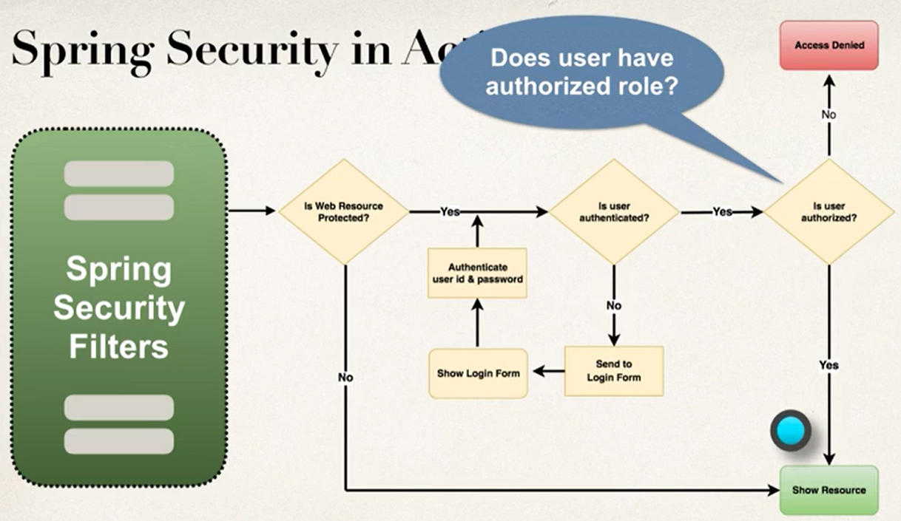
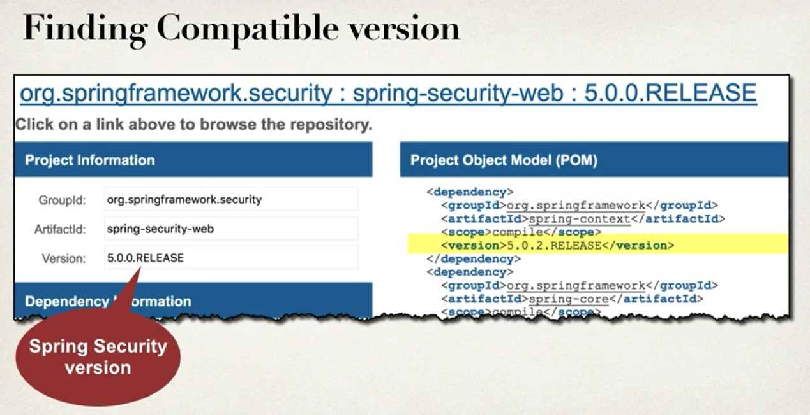

# Section47. Spring Security - Getting Started

### 스프링 시큐리티를 이해하기 위한 기본적인 개념들

스프링 시큐리티

- 스프링 시큐리티는 보안기능을 지원하는 모듈이다
- 서블릿 필터를 백그라운드에서 사용해 실행한다
- 서블릿 필터는 웹 요청의 전처리 후처리에 사용된다
- 서블릿 필터는 보안 로직에 따라 라우팅 처리가 가능하다

스프링 시큐리티의 작동 방향을 간단히 표현하면 다음과 같다

```txt
    Web browser      -> Spring Security Filter(Servlet filter) ->          Protected Web Resource
유저가 특정 자원 요청 ->      요청을 인터셉트, 전처리            -> (자원에 접근할 수 있는 유저라면)자원 전달
                              이 과정에서 처리하는 것들
                              my app configuration
                              user password
                              user role
```

플로우 차트로 실행과정 살펴보기


- 먼저 보안이 필요한 자원인지 살펴본다
- 보안이 필요없는 자원이라면 해당 자원을 준다
- 보안이 필요하다면 인증된 유저인지 체크가 필요하다
- 체크를 위해 로그인 폼을 보내 id와 password로 인증절차를 거친다
- 인증이 완료되면 해당 유저가 자원에 접근할 권한이 있는지 확인한다
- 권한이 있다면 자원을 보내고, 권한이 없다면 접근을 거부한다

보안에 중요한 몇가지 개념들

- Authentication
  - app이나 db에 저장되어 있는 유저의 id, password를 체크하는 것
- Authorization
  - 유저가 특정 자원에 접근 가능한 권한이 있는지 체크하는 것

선언적(Declarative)으로 보안 설정하기

- 선언적이란 필요한 기능을 구현하는 과정을 일일이 명시하지 않고 필요한 기능을 지정하는 것을 말한다
- 스프링 시큐리티는 필요한 보안 기능을 Java나 Xml로 작성된 설정 파일에 선언하는 방식을 사용한다
- 이렇게 함으로써 애플리케이션 코드와 보안 코드의 관심사를 분리해서 관리하는 것이 스프링 시큐리티의 특징이다

프로그래머틱한(Programmatic) 보안 설정

- 스프링 시큐리티는 커스터마이징을 위한 API들을 제공한다
- 스프링 시큐리티가 기본적인 보안 기능들을 제공해주지만 상황에 따라 얼마든지 확장이 가능하다

로그인 방법들

- HTTP Basic Authentication
  - 브라우저의 기본 모달을 이용한 로그인
  - 비쥬얼이 끔찍하기 때문에 때문에 현재는 거의 사용하지 않는 방법이다
- Default login form
  - 스프링 시큐리티가 기본으로 제공해주는 로그인 폼
- Custom login form
  - html, css, js로 만든 커스텀 로그인 폼

---

### 자바를 이용한 스프링 시큐리티 설정(No xml)

XML설정 없이 순수 자바코드로만 스프링 시큐리티를 설정하는 방법을 알아보자

개발과정

1. 스프링 MVC Web App을 만들기 위한 메이븐 의존성 추가
2. @Configuration애노테이션을 사용해 설정 클래스 만들기
3. 스프링 디스패처 서블릿 이니셜라이저 만들기
4. 스프링 컨트롤러 만들기
5. JSP View page 만들기

---

스프링 MVC Web App을 만들기 위한 메이븐 의존성 추가

pom.xml 파일에 추가할 코드

```xml
<!-- Spring MVC support -->
<dependency>
  <groupId>org.springframework</groupId>
  <artifactId>spring-webmvc</artifactId>
  <version>...</version>
</dependency>

<!-- Spring MVC support -->
<dependency>
  <groupId>javax.servlet</groupId>
  <artifactId>javax.servlet-api</artifactId>
  <version>...</version>
</dependency>

<dependency>
  <groupId>javax.servlet.jsp</groupId>
  <artifactId>javax.servlet.jsp-api</artifactId>
  <version>...</version>
</dependency>

<dependency>
  <groupId>javax.servlet</groupId>
  <artifactId>jstl</artifactId>
  <version>...</version>
</dependency>

<build>

  <pluginManagement>
    <plugins>

      <plugin>
        <!-- Add Maven coordinates (GAV) for: maven-war-plugin -->
        <groupId>org.apache.maven.plugins</groupId>
        <artifactId>maven-war-plugin</artifactId>
        <version>3.2.0</version>
      </plugin>

    </plugins>
  </pluginManagement>

</build>
```

- 자바 코드로만 설정을 하면 빌드시에 web.xml이 없다는 에러가 발생한다
- plugin에 maven-war-plugin을 추가해줘야 web.xml이 없어도 에러가 발생하지 않는다
- 자바 코드로 설정을 하면 더 이상 web.xml, spring-mvc-demo-servlet.xml이 필요 없다
- 대신 @Configuration을 사용한 클래스와 스프링 디스패처, 스프링 이니셜라이저가 필요하다

XML 설정 되돌아보기(the old way)

spring-mvc-demo-servlet.xml을 순수 자바코드로 대체하기

```xml
<beans>

  <!-- Add support for component scanning -->
  <context:component-scan base-package="com.luv2code.springdemo" />

  <!-- Add support for conversion, formatting and validation support -->
  <mvc:annotation-driven />

  <!-- Define Spring MVC view resolver -->
  <bean
    class="org.springframework.web.servlet.view.InternalResourceViewResolver">
    <property name="prefix" value="/WEB-INF/view/" />
    <property name="suffix" value=".jsp" />
  </bean>

</beans>
```

- 이전에는 위와 같은 xml 설정이 필요했다
- 순수 자바코드로 위 설정을 어떻게 대체할 수 있는지 알아보자

Enabling the MVC Java Config

- @EnableWebMvc
  - 이 애노테이션은 위 xml설정에서 <mvc:annotation-driven />과 같은 역할을 한다
  - 이 설정은 conversion, formatting, validation을 지원한다
  - 그리고 @Controller 클래스와 @RequestMapping이 적용된 메소드를 처리한다

@Configuration애노테이션을 사용해 설정 클래스 만들기

DemoAppConfig.java

```java
@Configuration
@EnableWebMvc
@ComponentScan(basePackages="com.luv2code.springsecurity.demo") // 컴포넌트 스캔 경로
public class DemoAppConfig {

  // define a bean for ViewResolver - 뷰리졸버 정의하기

  @Bean
  public ViewResolver viewResolver() {

    InternalResourceViewResolver viewResolver = new InternalResourceViewResolver();

    viewResolver.setPrefix("/WEB-INF/view/");
    viewResolver.setSuffix(".jsp");

    return viewResolver;
  }
}
```

- 순수 자바코드로 컴포넌트 스캔, 뷰리졸버까지 추가한 완전한 기본설정 코드다

web.xml파일을 순수 자바코드로 대체하기

```xml
<web-app>

  <!-- 1번 부분 -->
  <servlet>
    <servlet-name>dispatcher</servlet-name>
    <servlet-class>org.springframework.web.servlet.DispatcherServlet</servlet-class>

    <init-param>
      <param-name>contextConfigLocation</param-name>
      <param-value>/WEB-INF/spring-mvc-demo-servlet.xml</param-value>
    </init-param>

    <load-on-startup>1</load-on-startup>
  </servlet>
  <!-- 1번 부분 끝 -->

  <!-- 2번 부분 -->
  <servlet-mapping>
    <servlet-name>dispatcher</servlet-name>
    <url-pattern>/</url-pattern>
  </servlet-mapping>
  <!-- 2번 부분 끝 -->

</web-app>
```

---

스프링 디스패처 서블릿 이니셜라이저 만들기

Web App Initializer

- 스프링 MVC는 웹앱 초기화를 지원한다
- 초기화를 통해 작성했던 코드가 자동적으로 탐지된다
- 작성했던 코드는 서블릿 초기화하는 데 사용될 것이다
  - AbstractAnnotationConfigDispatcherServletInitializer

AbstractAnnotationConfigDispatcherServletInitializer

- 이 추상클래스에 해야 하는 것
  - 이 추상클래스를 확장하는 것
  - 필수 메서드를 오버라이드
  - 서블릿 매핑과 앱 설정 파일 위치를 지정하기

MySpringMvcDispatcherServletInitializer.java

```java
import org.springframework.web.servlet.support.AbstractAnnotationConfigDispatcherServletInitializer;

public class MySpringMvcDispatcherServletInitializer
       extends AbstractAnnotationConfigDispatcherServletInitializer {

  @Override
  protected Class<?>[] getRootConfigClasses() {
    return null;
  }

  // 위에 web.xml의 주석에 작성한 1번 부분을 대체하는 자바 코드다
  @Override
  protected Class<?>[] getServletConfigClasses() {
    return new Class[] { DemoAppConfig.class };
  }

  // 위에 xeb.xml의 주석에 작성한 2번 부분을 대체하는 자바 코드다
  @Override
  protected String[] getServletMapping() {
    return new String[] { "/" };
  }
}
```

---

스프링 컨트롤러 만들기

DemoController.java

```java
@Controller
public class DemoController {

  @GetMapping("/")
  public String showHome() {

    return "home";
  }
}
```

JSP View page 만들기

/WEB-INF/view/home.jsp

```html
<html>
  <body>
    Welcome to the luv2code company home page!
  </body>
</html>
```

---

Maven에 스프링 시큐리티 의존성 추가하기

- 스프링 시큐리티는 두 개의 의존성을 가지고 있다
  - spring-security-web
  - spring-security-config
- 특이한 점
  - 과거에 스프링 시큐리티와 다른 스프링 프레임워크 모듈은 릴리즈 주기와 버전 넘버가 일치하지 않았다
  - 따라서 최신 버전이 아닌 스프링 시큐리티를 사용할 때는 메이븐 리포지토리에 검색해서 스프링 컨텍스트 버전과 일치하는 특정 버전의 스프링 시큐리티 버전을 지정해줘야 한다

버전 일치 예시


pom.xml설정

```xml
<properties>
  <springframework.version>5.0.2RELEASE</springframework.version>
  <springsecurity.version>5.0.0RELEASE</springsecurity.version>
</properties>

<!-- ... -->

<!-- Spring -->
<dependency>
  <groupId>org.springframework</groupId>
  <artifactId>spring-webmvc</artifactId>
  <version>${springframework.version}</version>
</dependency>

<!-- Spring Security -->
<dependency>
  <groupId>org.springframework.security</groupId>
  <artifactId>spring-security-web</artifactId>
  <version>${springsecurity.version}</version>
</dependency>

<dependency>
  <groupId>org.springframework.security</groupId>
  <artifactId>spring-security-config</artifactId>
  <version>${springsecurity.version}</version>
</dependency>
```

- 프로퍼티로 스프링 프레임워크 버전과 맞는 스프링 시큐리티 버전을 등록했다
- 의존성을 추가할 때 프로퍼티로 등록한 버전을 사용했다

* 2019.11.4 릴리즈된 Spring Security 5.2.1
  - Spring framework 5.2.1버전과 호환된다
  - 따라서 이 최신버전을 사용하려면 xml에 다음과 같이 프로퍼티를 등록하면 된다

```xml
<properties>
  <springframework.version>5.2.1RELEASE</springframework.version>
  <springsecurity.version>5.2.1RELEASE</springsecurity.version>
</properties>
```

---

기본적인 보안 기능 추가하기

개발과정

1. 스프링 시큐리티 이니셜라이저 만들기
2. 스프링 시큐리티 설정 만들기
3. user, password, role 추가하기

스프링 시큐리티 이니셜라이저 만들기

- 스프링 시큐리티는 보안 초기화를 지원한다
- 작성한 보안 코드는 서블릿 컨테이너를 초기화하는데 사용된다
- 스프링 시큐리티 필터를 등록하기 위한 특별한 클래스를 만들어야 한다

  - AbstractSecurityWebApplicationInitializer
  - 이 추상클래스를 확장해서 구현해야 한다
  - 이 클래스가 처음 설명했던 것처럼 유저의 요청을 인터셉트해서 여러 보안 기능을 처리한다

SecurityWebApplicationInitializer.java

```java
import org.springframework.web.servlet.support.AbstractSecurityWebApplicationInitializer;

public class SecurityWebApplicationInitializer
       extends AbstractSecurityWebApplicationInitializer {
}
```

---

스프링 시큐리티 설정 클래스 만들기

DemoSecurityConfig.java

```java
import org.springframework.context.annotation.Configuration;
import org.springframework.security.config.annotation.web.configuration.EnableWebSecurity;
import org.springframework.security.config.annotation.web.configuration.WebSecurityConfigurerAdapter;

@Configuration
@EnableWebSecurity
public class DemoSecurityConfig extends WebSecurityConfigurerAdapter {

}
```

---

user, password, role 추가하기

DemoSecurityConfig.java

```java
@Configuration
@EnableWebSecurity
public class DemoSecurityConfig extends WebSecurityConfigurerAdapter {

  @Override
  protected void configure(AuthenticationManagerBuilder auth) throws Exception {

    // add our users for in memory authentication

    UserBuilder users = User.withDefaultPasswordEncoder();

    auth.inMemoryAuthentication()
      .withUser(users.username("john").password("test123").roles("EMPLOYEE"))
      .withUser(users.username("mary").password("test123").roles("MANAGER"))
      .withUser(users.username("susan").password("test123").roles("ADMIN"));
  }
}
```

- 지금은 메모리에 인증 코드를 만들어 처리한다
- 위 코드만으로는 비즈니스 레벨의 문제를 처리할 수 없다
- 위 코드는 어디까지나 인증을 이해하기 위한 예제이므로 개념을 익히는데 집중하면 된다
- 차후 암호화한 패스워드와 함께 데이터베이스를 이용해 처리하는 방법도 알아볼 것이다
- cf) Spring Security 5.0.2 에서 User.withDefaultPasswordEncoder는 deprecated되었다

---
