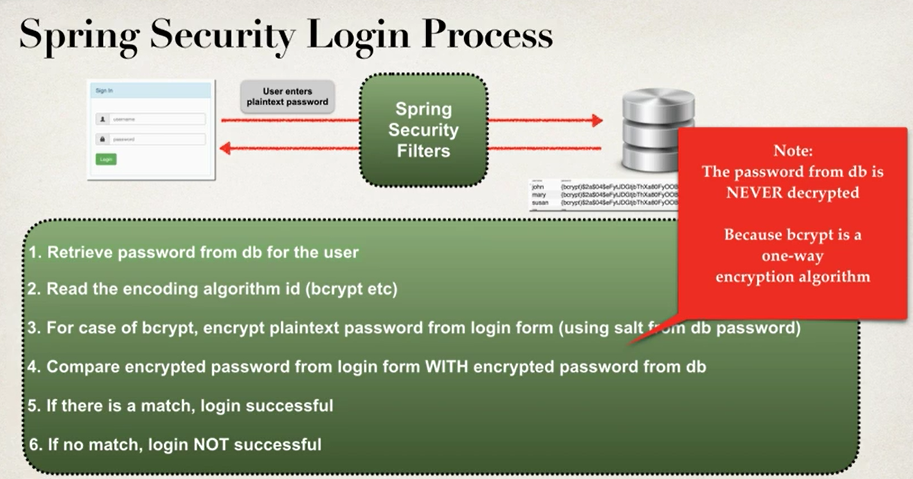

# Section 55. Spring security - Password Encryption

스프링 시큐리티에서 비밀번호를 암호화하는 방법을 알아본다

스프링 시큐리티 팀의 추천

- 스프링 시큐리티는 bcrypt 해싱 알고리즘을 추천한다
- bcrypt는 단방향 해싱 알고리즘으로 암호화를 위해 패스워드에 랜덤 솔트값을 추가한다
  - 추가로 brute force 공격에 대한 대비도 지원한다

bcrypt에 대한 더 많은 자료

```text
Why you should use bcrypt to hash passwords

www.luv2code.com/why-bcrypt

---

Detailed bcrypt algorithm analysis

www.luv2code.com/bcrypt-wiki-page

---

Password hashing - Best Practices
www.luv2code.com/password-hashing-best-practices
```

개발과정

1. 암호화된 비밀번호를 저장하기 위한 SQL 스크립트 실행
   - 패스워드 필드의 길이가 68이도록 DDL 수정
   - {bycrypt}부분의 길이가 8이고 인코딩된 비밀번호의 길이가 항상 60이기 때문에 최소길이가 68이어야 한다
2. 새로운 데이터베이스 스키마를 가리키도록 데이터베이스 프로퍼티 파일 수정

암호화된 비밀번호를 저장하기 위한 SQL 스크립트 실행

```sql
CREATE TABLE 'users' (
  'username' VARCHAR(50) NOT NULL,
  'password' CHAR(68) NOT NULL,
  'enabled' TINIINT(1) NOT NULL

  PRIMARY KEY ('username')
) ENGINE=InnoDB DEFAULT CHARSET=UTF-8;
```

```sql
INSERT INTO 'users'
VALUES
('john', '{bcrypt}encryptedPassword', 1),
('mary', '{bcrypt}encryptedPassword', 1),
('susan', '{bcrypt}encryptedPassword', 1);
```

persistence-mysql.properties

```txt
#
# JDBC connection properties
#
jdbc.driver=com.mysql.jdbc.Driver
jdbc.url=jdbc:mysql://localhost:3306/spring_security_demo_bcrypt?useSSL=false # 이 부분이 변경됐다
jdbc.user=root
jdbc.password=qodjstn!00

#
# Connection pool properties
#
connection.pool.initialPoolSize=5
connection.pool.minPoolSize=5
connection.pool.maxPoolSize=20
connection.pool.maxIdleTime=3000
```

bcrypt를 이용했을 때의 스프링 시큐리티 로그인 프로세스


새로운 데이터베이스 스키마를 가리키도록 데이터베이스 프로퍼티 파일 수정
