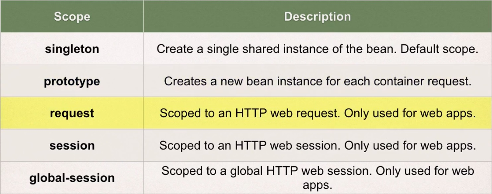
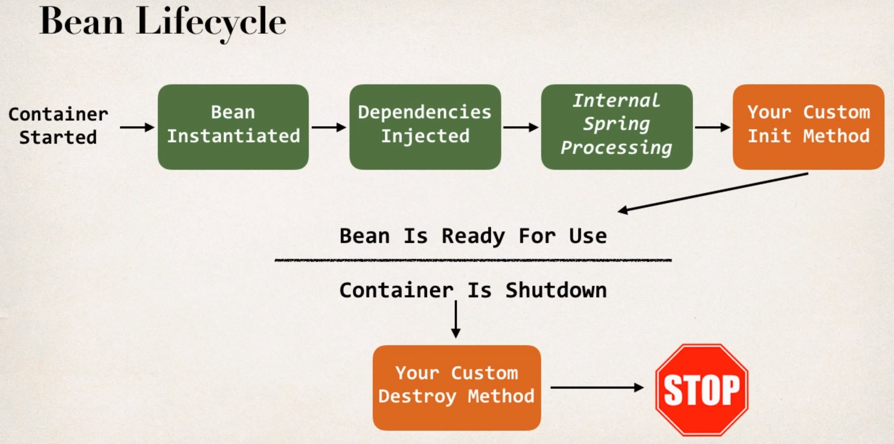

# Section 6. Spring Bean Scopes and Lifecycle

### lecture 44. Bean Scopes - Overview

빈 스코프
* 빈 스코프는 빈의 생명주기를 참조한다
  - 빈이 얼마동안 살아있는가?
  - 인스턴스는 몇개나 생성되었는가?
  - 스프링 환경 안에서 어떻게 빈이 공유되는가?

빈의 기본 스코프는 싱글턴이다
```xml
<beans ... >
    <bean id="myCoach"
        class="com.luv2code.springdemo.TrackCoach"
        scope="singleton">
      ...
    </bean>
</beans>
```
* 스프링 컨테이너는 오직 하나의 빈 인스턴스만 생성한다
* 생성된 빈 인스턴스는 메모리에 캐싱한다
* 빈에 대한 모든 요청은 동일한 빈을 가리키는 공유된 참조를 반환할 것이다
* 위 코드에서처럼 bean에 scope 프로퍼티를 직접 지정할 수 있다

### 

프로토타입 스코프에서는 요청마다 새로운 인스턴스가 생성된다
```xml
<bean id="myCoach"
      class="com.luv2code.springdemo.TrackCoach"
      scope="prototype">
    <constructor-arg ref="myFortuneService" />
</bean>
```

---

### lecture 45 Bean Scope - Write Some Code - Part 1

```xml
<!-- beanScope-applicationContext.xml -->
<?xml version="1.0" encoding="UTF-8"?>
<beans xmlns="http://www.springframework.org/schema/beans"
    xmlns:xsi="http://www.w3.org/2001/XMLSchema-instance" 
    xmlns:context="http://www.springframework.org/schema/context"
    xsi:schemaLocation="http://www.springframework.org/schema/beans
    http://www.springframework.org/schema/beans/spring-beans.xsd
    http://www.springframework.org/schema/context
    http://www.springframework.org/schema/context/spring-context.xsd">

    <!-- Define your beans here -->
    
    <bean id="myFortuneService"
        class="com.luv2code.springdemo.HappyFortuneService">
    </bean>
    
    <bean id="myCoach"
        class="com.luv2code.springdemo.TrackCoach">
      <constructor-arg ref="myFortuneService" />
    </bean>
    
</beans>
```
* beanScope-applicationContext.xml 파일을 생성하고 위 내용을 입력한다

```java
// BeanScopeDemoApp.java
public class BeanScopeDemoApp {

	public static void main(String[] args) {
		
		// load the spring configuration file
		ClassPathXmlApplicationContext context = 
				new ClassPathXmlApplicationContext("beanScope-applicationContext.xml");
		
		// retrieve bean from spring container
        Coach theCoach = context.getBean("myCoach", Coach.class);
        Coach alpahCoach = context.getBean("myCoach", Coach.class);

	}

}
```
* 빈 스코프를 테스트할 클래스를 main함수를 포함시켜 BeanScopeDemoApp이라는 이름으로 만든다

---

### lecture 46. Bean Scopes - Write Some Code - Part 2

```java
package com.luv2code.springdemo;

import org.springframework.context.support.ClassPathXmlApplicationContext;

public class BeanScopeDemoApp {

	public static void main(String[] args) {
		
		// load the spring configuration file
		ClassPathXmlApplicationContext context = 
				new ClassPathXmlApplicationContext("beanScope-applicationContext.xml");
		
		// retrieve bean from spring container
        Coach theCoach = context.getBean("myCoach", Coach.class);
        Coach alphaCoach = context.getBean("myCoach", Coach.class);
        
        // check if they are the same
        boolean result = (theCoach == alphaCoach);

        // print out the results
        System.out.println("\nPointing to the same object: " + result);
        
        System.out.println("\nMemory location for the theCoach" + theCoach);
        
        System.out.println("\nMemory location for the alphaCoach" + alphaCoach + "\n");
        
        // close the context
        context.close();        
	}

}
```
* myCoach를 참조하는 인스턴스 두 개를 생성했다
* 그리고 result 변수에 두 인스턴스가 같은지 비교하는 로직을 작성한 후 출력하고 있다

```xml
<!-- true -->
<bean id="myCoach"
      class="com.luv2code.springdemo.TrackCoach">
    <constructor-arg ref="myFortuneService" />
</bean>

<bean id="myCoach"
      class="com.luv2code.springdemo.TrackCoach"
      scope="singleton">
    <constructor-arg ref="myFortuneService" />
</bean>

<!-- false -->
<bean id="myCoach"
      class="com.luv2code.springdemo.TrackCoach"
      scope="prototype">
    <constructor-arg ref="myFortuneService" />
</bean>
```
* scope를 지정하지 않거나 singleton으로 지정하면 true가 출력된다
* prototype으로 지정하면 매번 새로운 인스턴스가 생성되어 false가 출력된다

---

### lecture 47. Bean Lifecycle - Overview

### 

빈이 초기화 되는 동안에 커스텀한 코드를 추가할 수 있다
* 일반적으로 비즈니스 로직과 관련된 메서드를 추가하거나
* db, sockets, file 등의 자원을 다루고 세팅한다

```xml
<beans ...>
    <bean id="myCoach"
        class="com.luv2code.springdemo.TrackCoach"
        init-method="doMyStartupStuff">
      ...
    </bean>
</beans>
```
* init-method에 빈이 초기화될 때 실행할 메서드를 지정하고 있다

빈을 종료하는 와중에도 커스텀한 코드를 추가할 수 있다
* 마찬가지로 비즈니스 로직과 관련된 메서드를 추가하거나
* db, sockets, file 등의 자원과 연결을 끊는데 사용한다

```xml
<beans ...>
    <bean id="myCoach"
        class="com.luv2code.springdemo.TrackCoach"
        init-method="doMyStartupStuff"
        destroy-method="doMyCleanupStuff">
      ...
    </bean>
</beans>
```
* destroy-method에 빈을 종료할 때 실행할 메서드를 지정하고 있다

---

### lecture 48. Special Note: Defining init and destroy methods - Method Signatures

init-method와 destroy-method와 관련된 디테일들
* 접근 제한자
  - public, private, protected 모두 사용할 수 있다
* 반환 타입
  - 어떤 타입도 가능하지만 일반적으로 void를 사용한다
* 메소드 이름
  - 어떤 이름이든 상관없다
* 인자들
  - 이 메소드들은 어떤 인자도 가질 수 없다

---

### lecture 49. Bean Lifecycle - Write Some Code

init-method
```java
public void doMyStartupStuff() {
		System.out.println("TrackCoach: inside method doMyStartupStuff");
}
```
* TrackCoach 아래에 작성해준다

destroy-method
```java
public void doMyCleanupStuffYoYo() {
		System.out.println("TrackCoach: inside method doMyCleanupStuffYoYo");
}
```
* 마찬가지로 TrackCoach 아래에 작성해준다

스프링 설정 파일 작성
```xml
<?xml version="1.0" encoding="UTF-8"?>
<beans xmlns="http://www.springframework.org/schema/beans"
    xmlns:xsi="http://www.w3.org/2001/XMLSchema-instance" 
    xmlns:context="http://www.springframework.org/schema/context"
    xsi:schemaLocation="http://www.springframework.org/schema/beans
    http://www.springframework.org/schema/beans/spring-beans.xsd
    http://www.springframework.org/schema/context
    http://www.springframework.org/schema/context/spring-context.xsd">

    <!-- Define your beans here -->
    
    <bean id="myFortuneService"
        class="com.luv2code.springdemo.HappyFortuneService">
    </bean>
    
    <bean id="myCoach"
        class="com.luv2code.springdemo.TrackCoach"
        init-method="doMyStartupStuff"
        destroy-method="doMyCleanupStuffYoYo">
      <constructor-arg ref="myFortuneService" />
    </bean>
</beans>
```
* 작성한 init method와 destroy method를 지정해준다

실행을 위한 BeanLifeCycleDemoApp 작성
```java
public class BeanLifeCycleDemoApp {

	public static void main(String[] args) {
		
		// load the spring configuration file
		ClassPathXmlApplicationContext context = 
				new ClassPathXmlApplicationContext("beanLifeCycle-applicationContext.xml");
		
		// retrieve bean from spring container
        Coach theCoach = context.getBean("myCoach", Coach.class);
        
        System.out.println(theCoach.getDailyWorkout());
        
        // close the context
        context.close();        
	}
}
```
* 실행결과
  - TrackCoach: inside method doMyStartupStuff
  - Run a hard 5k
  - TrackCoach: inside method doMyCleanupStuffYoYo

---

### lecture 50. Special Note about Destroy LifeCycle and Prototype Scope

프로토타입 스코프
* 이 스코프에서 생성된 빈은 destory method를 사용할 수 없다
  - init method는 사용할 수 있다
* 스프링은 다른 스코프들과 다르게 프로토타입 스코프와 관련된 생명주기는 완벽하게 관리하지 않는다
* 따라서 프로토타입 스코프 객체는 반드시 코드를 통해 제거해서 자원낭비를 없애야 한다
* XML과 어노테이션 설정 어떤 것이든 이런 특성이 적용된다

---